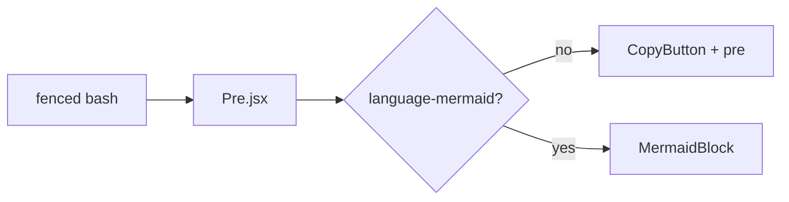

# Code-Block Pipeline Fixture (Phase 2 verification)

This file is NOT part of the dated spec. The leading underscore keeps build-manifest's
`^YYYY-MM-DD.md$` regex from matching it, so it never appears in the manifest and never
auto-loads. It exists so a human can verify the copy-code pipeline (REND-05) end-to-end
AND the D-13 mermaid-exclusion rule.

To use:
  1. Run `npm run dev`.
  2. Temporarily rename this file to `2099-01-02.md` so the manifest picks it as the
     newest snapshot. Restart `npm run dev` (the predev hook regenerates the manifest).
  3. Refresh the browser. The header should now read `Viewing: project-spec/2099-01-02.md`.
  4. Perform the checks described in Task 4 of 02-05-copy-code-PLAN.md.
  5. Rename the file back to `_phase2-codeblock-fixture.md` and restart `npm run dev`.

## Bash block (must show a copy button)

```bash
# Restart the dev server after editing the fixture
npm run dev

# Build for production
npm run build
```

## JSON block (must show a copy button)

```json
{
  "name": "macplants-erp-spec",
  "private": true,
  "scripts": {
    "dev": "vite --config app/vite.config.js"
  }
}
```

## Mermaid block (must NOT show a copy button — D-13)



## Inline `code` (must NOT show a copy button — D-13 attaches only to <pre>)

Inline references like `npm run dev` or `navigator.clipboard.writeText` should appear as
monospaced text without any copy-button affordance.

## End of fixture
