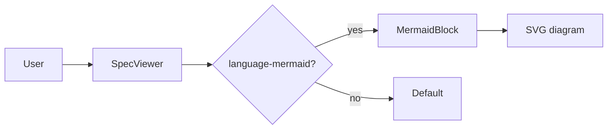

# Mermaid Pipeline Fixture (Phase 2 verification)

This file is NOT part of the dated spec. The leading underscore keeps build-manifest's
`^YYYY-MM-DD.md$` regex from matching it, so it never appears in the manifest and never
auto-loads. It exists so a human can verify that the Mermaid renderer + the parse-error
banner work end-to-end.

To use:
  1. Run `npm run dev`.
  2. Manually point the App to this file by editing `app/src/App.jsx` to load this filename
     in place of `manifest[0].filename` (revert after verification — do NOT commit the
     App.jsx change).
  Or:
  2'. Vite-in-browser: navigate to `/@fs/<repo-root>/project-spec/_phase2-mermaid-fixture.md?raw`
      to confirm the file is reachable, then verify by temporarily renaming it to
      `2099-01-01.md` and refreshing (revert the rename when done).

## Valid diagram (should render as SVG)



## Broken diagram (should render the red error banner above this source)

```mermaid
this is not valid mermaid syntax !!!
```

## End of fixture
